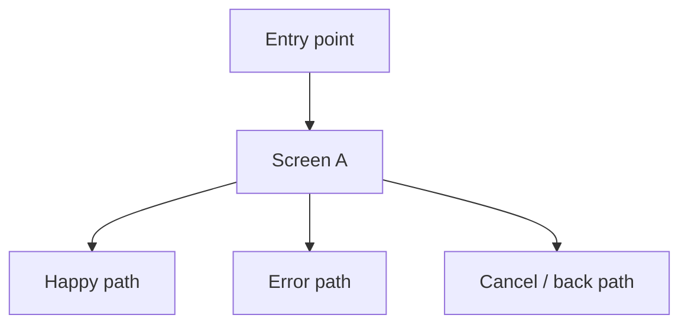

# Screen Spec: <Feature Name>

## Source Context

| Source | Type | Notes |
| --- | --- | --- |
| `<path-or-user-input>` | `CONTEXT / ADR / decision / PRD / issue / user input` | `<what was used>` |

## Feature Summary

- **Feature:** `<feature name>`
- **Primary actors:** `<actors>`
- **Business objective:** `<objective>`
- **Primary outcome:** `<outcome>`
- **Artifact path:** `docs/screen-specs/<feature-slug>.md`

## Requirements Reference

| ID | Source | Text | Screens |
| --- | --- | --- | --- |
| REQ-001 | `<source>` | `<requirement text>` | `<screen names or Open Question>` |
| ADR-001 | `<source>` | `<ADR or decision constraint>` | `<screen names or Open Question>` |

## Actors / Roles

| Actor / Role | Permissions / Constraints | Jobs-to-be-Done |
| --- | --- | --- |
| `<role>` | `<permissions and constraints>` | `<jobs>` |

## Screen Inventory

| Screen | Route / Screen ID | User Flow Group | Purpose | Primary Action | Requirements |
| --- | --- | --- | --- | --- | --- |
| `<screen name>` | `<route or ID>` | `<flow>` | `<purpose>` | `<action>` | `REQ-001` |

## Screen Flow

## Screen Details

### <Screen Name>

**Purpose:** `<why this screen exists>`

**Entry points:** `<where users come from>`

**Exits:** `<where users can go next>`

**Requirements satisfied:** `REQ-001`, `ADR-001`

#### Components

| Component | Purpose | Data Displayed / Collected | Business Rule |
| --- | --- | --- | --- |
| `<component>` | `<purpose>` | `<data>` | `REQ-001` |

#### Forms

| Form | Field | Type | Required | Validation | Default / Source | Business Rule |
| --- | --- | --- | --- | --- | --- | --- |
| `<form name>` | `<field name>` | `<text/select/date/etc.>` | `<yes/no/conditional>` | `<validation rule>` | `<default or source>` | `REQ-001` |

#### Tables / Lists

| Table | Column | Data Source | Sort / Filter / Search | Row / Batch Actions | Business Rule |
| --- | --- | --- | --- | --- | --- |
| `<table name>` | `<column name>` | `<source>` | `<sort/filter/search behavior>` | `<actions>` | `REQ-001` |

#### Interactions

| Action | Trigger | Result | Business Rule |
| --- | --- | --- | --- |
| `<action>` | `<click/submit/change/etc.>` | `<result>` | `REQ-001` |

#### States

| State | When | UI Behavior |
| --- | --- | --- |
| Default | `<when>` | `<behavior>` |
| Loading | `<when>` | `<behavior>` |
| Empty | `<when>` | `<behavior>` |
| Error | `<when>` | `<behavior>` |
| Validation | `<when>` | `<behavior>` |
| Permission denied | `<when>` | `<behavior>` |
| Success | `<when>` | `<behavior>` |

#### Business Rules

- `REQ-001`: `<how the requirement appears on this screen>`
- `ADR-001`: `<how the ADR or decision constrains this screen>`

## Shared UI Patterns

| Pattern | Applies To | Behavior | Requirements |
| --- | --- | --- | --- |
| `<pattern>` | `<screens>` | `<behavior>` | `REQ-001` |

## Open Questions

| ID | Question | Impact | Owner / Next Step |
| --- | --- | --- | --- |
| OQ-001 | `<question>` | `<screen/field/column/validation/navigation impact>` | `<owner or next step>` |

## Next Steps

- Resolve open questions that affect screen count, navigation, fields, columns, validation, or permissions.
- Hand this artifact to `$impeccable shape` for UX hierarchy, layout strategy, interaction refinement, and visual direction.
- Do not change required fields, columns, or business rules during `$impeccable shape` unless the change is recorded as an open question or requirement update.
