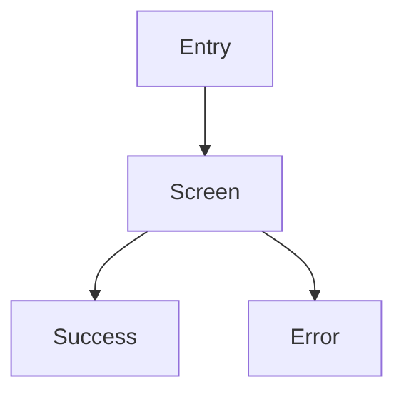

# Screen Spec Workflow

Use this workflow when the user has product requirements, business logic, a PRD, or feature rules and needs to turn them into implementation-ready UX architecture before visual design.

## Goal

Produce a screen specification that explains which screens exist, how they connect, what each screen contains, which business rules appear in the UI, and what states must be designed.

## Process

1. Read the PRD, business rules, existing plan, local issue, or user-provided requirements.
2. Identify actors, roles, permissions, and primary jobs-to-be-done.
3. Extract the required screens and flows.
4. Map business rules to visible UI behavior.
5. Define states and edge cases per screen.
6. Produce a handoff that `$impeccable shape` can use as task scope.

## Output Shape

### Feature Summary

- What this feature does
- Who uses it
- Primary outcome

### Actors / Roles

- actor or role name
- permissions or constraints
- main jobs-to-be-done

### Screen Inventory

For each screen:

- **Screen name**
- **Route or screen ID**
- **Purpose**
- **Primary user action**
- **Data displayed**
- **Data collected**
- **Components**
- **Business rules visible on this screen**
- **States**
  - default
  - loading
  - empty
  - error
  - validation
  - permission denied
  - success

### Screen Flow

Describe:

- entry points
- exits
- back and cancel behavior
- destructive or confirmation paths
- cross-screen dependencies

Use Mermaid when helpful:

### Shared UI Patterns

Define patterns that should stay consistent:

- navigation model
- layout shell
- forms
- tables or lists
- modals or drawers
- notifications
- permissions and disabled-state behavior

### Acceptance Criteria Per Screen

For each screen, list concrete criteria the implementation must satisfy.

### Open Questions

List unresolved product or UX questions. Do not hide decisions that affect screen count, navigation, validation, or data requirements.

### Handoff To Impeccable

Summarize:

- what `$impeccable shape` should use as task scope
- which screens need visual direction
- which screens are dense product UI
- which screens are brand or marketing UI
- which states need special attention

## Rules

- Do not design visual style here. This workflow defines UX architecture.
- Do not skip states. Missing empty, error, validation, and permission states become implementation defects.
- Do not invent backend behavior. If a business rule is unclear, list it as an open question.
- Keep screen specs concrete enough for implementation and for `$impeccable shape`.
